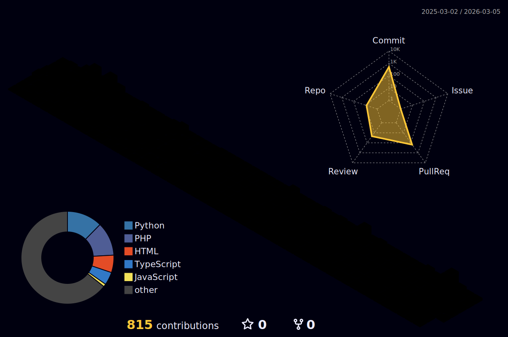

<!-- 🚗🚘🚛 헤더 -->

<!-- 👋 인사 메시지 -->

---

## 📊 GitHub Stats & Most Used Languages

  
  

---

## 🚀 Contribution Graph

  

---

## 🏆 GitHub Profile Summary & Streaks

  
  

---

## 🌟 3D Contribution Graph

  

---

## 👀 Visitor Count

  

